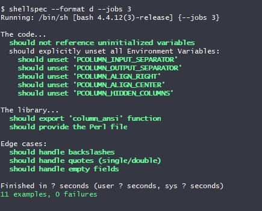
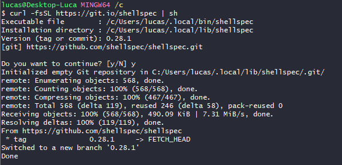

# Table of Contents
- [Table of Contents](#table-of-contents)
- [Development contributions](#development-contributions)
	- [Run tests](#run-tests)
	- [Installing Shellspec](#installing-shellspec)


# Development contributions
Before submitting a change to the code:
- **Run tests** to make sure that the existing ones work
- If possible add **new tests** concerning the new feature

  

## Run tests
To run all the defined tests: 
```shell
shellspec --format d --jobs 3
```

## Installing Shellspec
Make sure to have **Git installed**, then [install Shellspec](https://github.com/shellspec/shellspec#web-installer-for-developers)
```shell
bash <(curl -fsSL https://git.io/shellspec) 0.28.1 --prefix ~/.local
```


> **Side note**
> 
> When installing Spellspec on Cygwin make sure to have Git installed as a **Cygwin package**, since using the Windows version will **break the installation** process.

After this, you'll be able to find the binary file under `~/.local/bin`. Now we just need to add this folder to the `PATH` environment variable to make the `shellspec` binary always available.

This can be achieved by adding this command to `~/.bash_profile` if using Bash or `~/.profile` otherwise.

- **Bash**:
	```shell
	echo 'PATH=~/.local/bin:$PATH' >> ~/.bash_profile
	```
- **Other** shells:
	```shell
	echo 'PATH=~/.local/bin:$PATH' >> ~/.profile
	```

<!-- 
# Creating tests

If you want to make the tests executable with shellcheck add the following at the start:
```shell
eval "$(shellspec - -c) exit 1"
``` -->